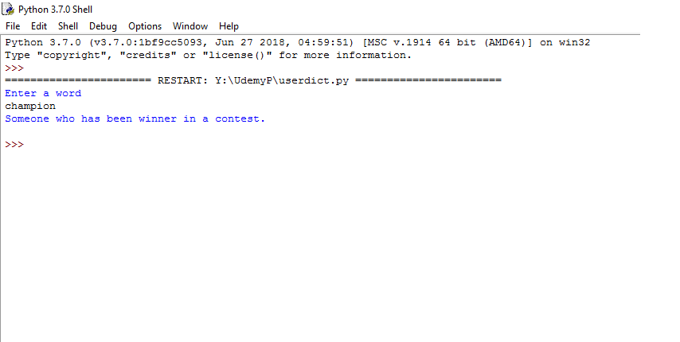
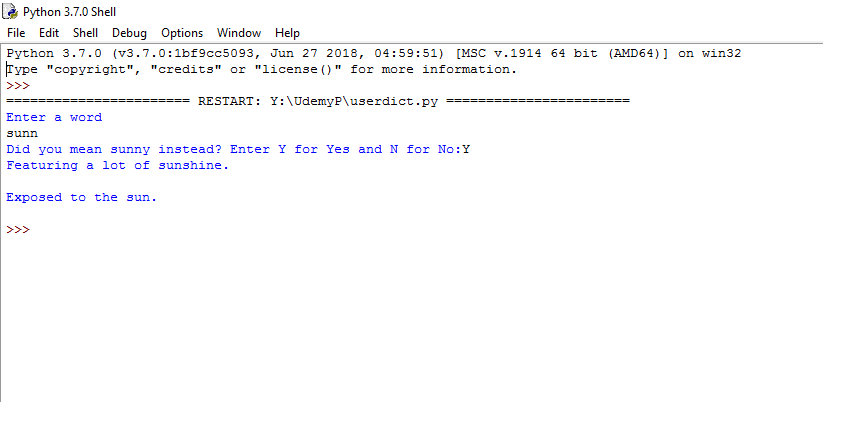

# User-Input-Dictionary

This is a simple dictionary which requests user to input a word and it returns its meaning.
For simplicity, data.json file is used to extract meaning for a given word.

 
 
This dictionary also asks user if he/she has mistyped the word :)
 

